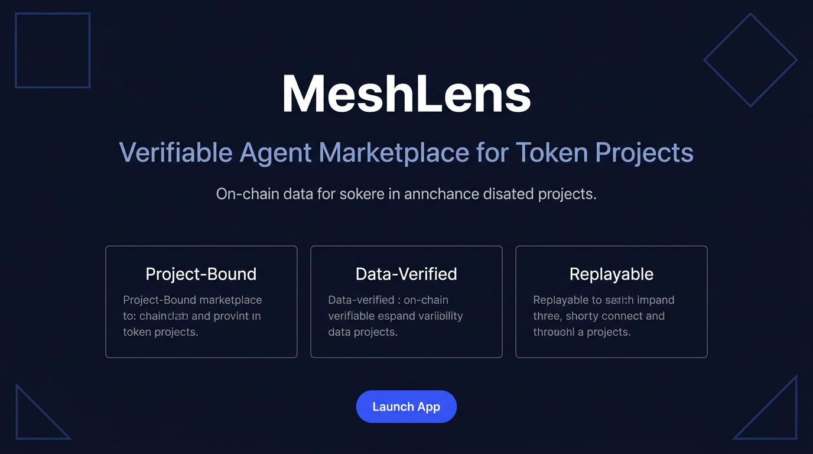

# MeshLens

[](LICENSE)
[](https://nextjs.org/)

> A verifiable agent marketplace for token projects.

**Repository:** [github.com/alvin20062006-beep/Meshlens](https://github.com/alvin20062006-beep/Meshlens)

## Preview

Product landing page (`/`):



## What is MeshLens?

Not a launchpad. Not a terminal. An execution layer.

Turns real on-chain project data into verifiable, replayable agent outputs.

## Key Features

- Project-Bound: Bags-verified projects only
- Data-Verified: all outputs cite real on-chain sources
- Replayable: every job stored in Supabase as auditable snapshot
- Agent Marketplace: extensible registry with importable manifests
- LLM-Agnostic: works with any OpenAI-compatible provider

## Architecture

UI (Next.js) → Agent Marketplace → API Routes → Execution Engine  
↓ Bags + Helius + LLM Provider  
↓ Supabase

## Data Sources

| Data | Source |
|------|--------|
| Project identity | Bags SDK/API |
| Holder distribution | Helius DAS getTokenAccounts |
| Token supply | Solana RPC getTokenSupply |
| Analysis | Configurable LLM provider |
| Job storage | Supabase |

## Setup

1. Clone repo
2. `cp .env.example .env.local`
3. Fill in all env vars
4. Create Supabase tables (see schema below)
5. `npm install`
6. `npm run dev`

## API Routes

- `POST /api/connect` — resolve project slug (Bags when `BAGS_API_KEY` is set; demo slugs `demo`/`test` when demo connect is on — default on, set `NEXT_PUBLIC_DEMO_CONNECT=false` to disable)
- `POST /api/run/[agentId]` — run an agent by id
  - `holder_insight_v1` → holder distribution snapshot + analysis
  - `growth_strategist_v1` → 7-day growth plan

## Supabase Schema

```sql
-- Projects table
create table if not exists public.projects (
  id uuid primary key default gen_random_uuid(),
  slug text unique not null,
  name text not null,
  mint text not null,
  source_url text not null,
  verification text not null,
  created_at timestamptz not null default now(),
  updated_at timestamptz not null default now()
);

-- Jobs table
create table if not exists public.jobs (
  id text primary key,
  agent_id text not null,
  project_id uuid references public.projects(id),
  status text not null,
  input jsonb not null default '{}'::jsonb,
  output jsonb,
  data_snapshot jsonb,
  error text,
  created_at timestamptz not null default now(),
  updated_at timestamptz not null default now()
);

create index if not exists idx_jobs_created_at on public.jobs(created_at desc);
create index if not exists idx_jobs_project_id on public.jobs(project_id);
```

## Demo Flow

1. Enter Bags project URL → verified badge (requires `BAGS_API_KEY` unless using optional demo mode)
2. Select Holder Insight Agent → Run
3. View results with citations
4. History → Replay same job → identical result
5. Import custom agent JSON → appears as coming soon

**Demo connect** is on by default: slugs `demo` / `test` work without Bags, and `/connect` shows “Use Demo Project”. Set `NEXT_PUBLIC_DEMO_CONNECT=false` for Bags-only deployments.

## Security / RLS Note

- For the demo version, keep Supabase configuration simple enough for the app to run
- Production deployments should add proper Row Level Security (RLS) policies and stricter access controls

## Environment Variables

Required:

- `NEXT_PUBLIC_SUPABASE_URL`
- `NEXT_PUBLIC_SUPABASE_ANON_KEY`
- `SUPABASE_SERVICE_ROLE_KEY`
- `HELIUS_API_KEY` (required for holder insight on-chain fetch)
- `LLM_API_KEY` / `LLM_MODEL` (optional; analysis will fall back if missing)
- `LLM_PROVIDER` (optional base URL for your OpenAI-compatible provider)

Optional:

- `BAGS_API_KEY` (enables Bags lookup for real projects)
- `NEXT_PUBLIC_DEMO_CONNECT` (set to `false` to disable demo slugs and the demo button; omit or any value except `false` keeps demo on)

## License

[MIT](LICENSE)

## GitHub 仓库设置（手动）

在仓库 **Settings → General** 的 **About** 中可填写：

| 项 | 建议内容 |
|----|----------|
| **Description** | Verifiable agent marketplace for token projects — on-chain data, replayable jobs, Next.js + Supabase. |
| **Website** | 若有线上 Demo，填 Vercel 等 URL |
| **Topics** | `nextjs` `react` `typescript` `solana` `web3` `supabase` `helius` `ai-agents` `token` `meshlens` |

**首发 Release：** 在本地 `git tag v0.1.0 && git push origin v0.1.0` 后，在 GitHub 上 **Releases → Draft a new release**，选择 tag `v0.1.0`，标题 `v0.1.0`，说明可粘贴 `CHANGELOG.md` 中对应段落。若已安装 [GitHub CLI](https://cli.github.com/)：`gh release create v0.1.0 --title "v0.1.0" --notes-file CHANGELOG.md`。

**还容易漏掉的项：** 在 **Settings → General** 勾选合适的默认分支；**Security** 下可启用 Dependabot；若用 Vercel，在托管平台配置环境变量（勿把密钥提交进仓库）；**Social preview** 可用同一张 `docs/screenshot-home.png` 作为 Open Graph 图（仓库无内置 OG 时 GitHub 仍主要显示 README 内图片）。
